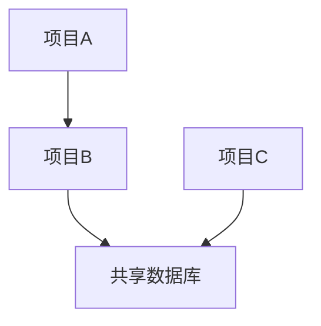

# 🌐 业务矩阵与生态全景图 (Business Overview)

`[实体: 全景, 生态]`
`[关联: 所有项目]`
`[状态: 活跃]`
`[更新日期: YYYY-MM-DD]`

---

## 📌 总体架构 (chunk: < 400 tokens)
*在此用一段话概述你的整个项目/业务生态的宏观结构。*

---

## 🗺️ 生态矩阵

| 项目群组 | 包含项目 | 技术栈 | 状态 |
| :--- | :--- | :--- | :--- |
| 群组 A | 项目1, 项目2 | [技术栈] | 活跃 |
| 群组 B | 项目3 | [技术栈] | 规划中 |
| 基础设施 | 密钥管理, 部署 | [技术栈] | 活跃 |

---

## 🔗 项目间关联

*(用 Mermaid 图或文字描述项目之间的依赖关系)*

---
> **记忆索引**: 各项目详情见 `20_项目知识库_Projects/` 下的独立文件。
